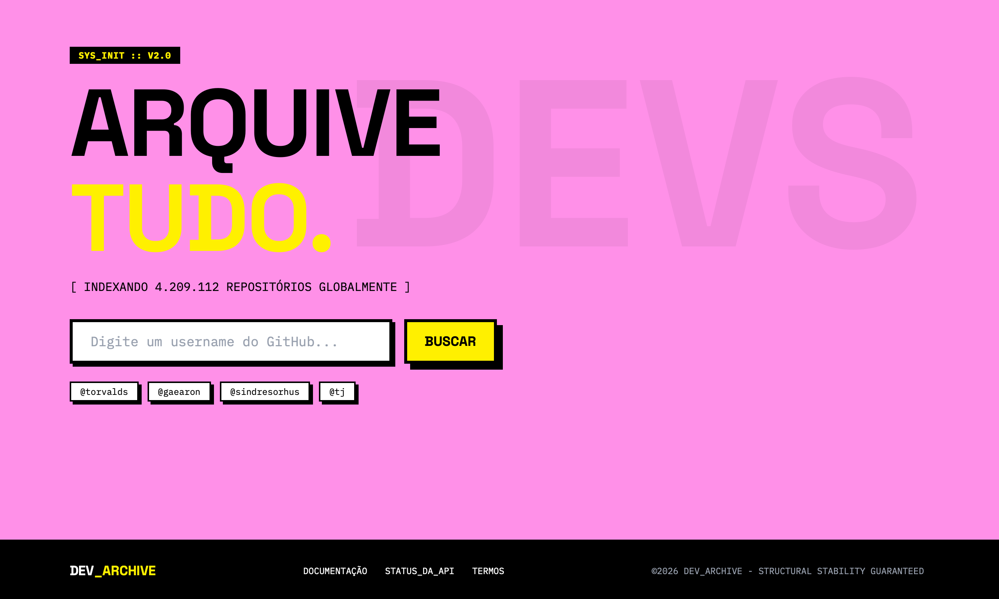
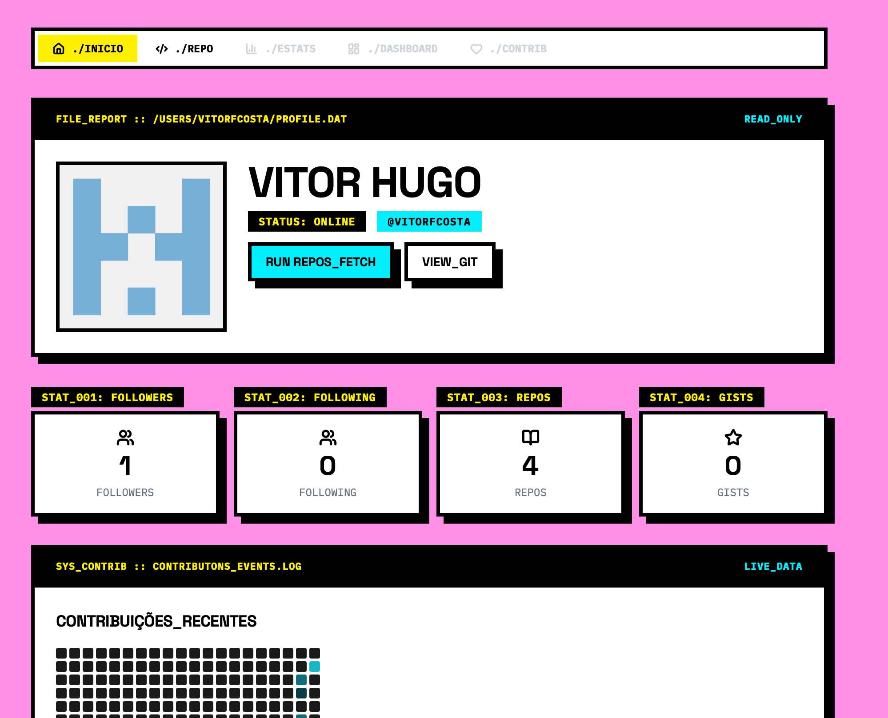
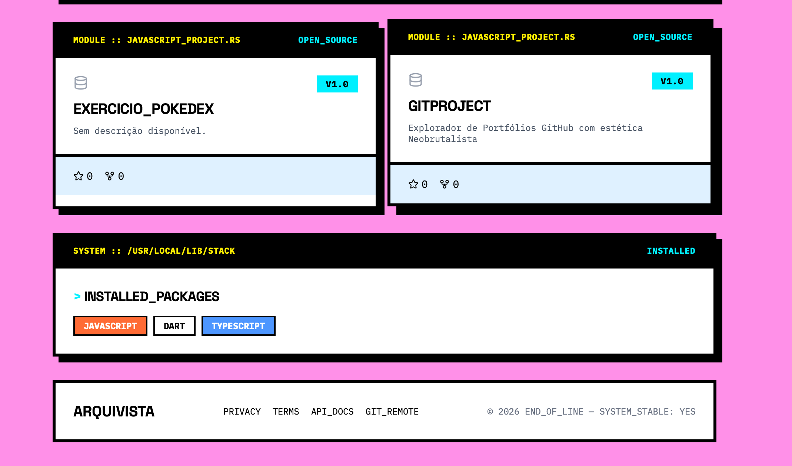
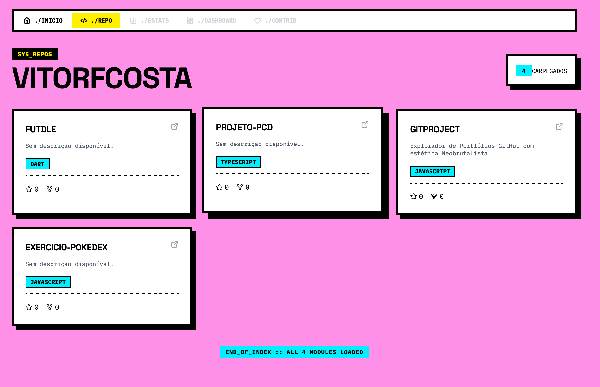
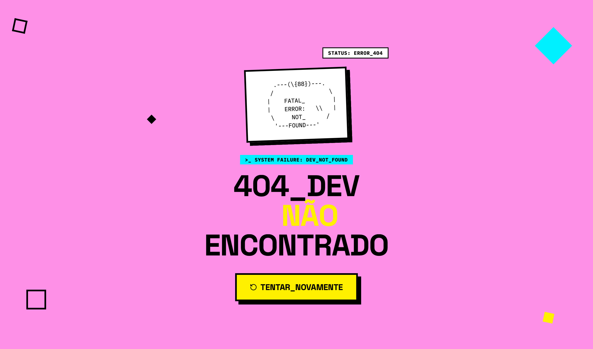

# ██ GITPROJECT — Explorador de Portfólios GitHub

<div align="center">

```
┌──────────────────────────────────────────────────┐
│                                                  │
│   ██████╗ ██╗████████╗██████╗ ██████╗  ██████╗   │
│  ██╔════╝ ██║╚══██╔══╝██╔══██╗██╔══██╗██╔═══██╗  │
│  ██║  ███╗██║   ██║   ██████╔╝██████╔╝██║   ██║  │
│  ██║   ██║██║   ██║   ██╔═══╝ ██╔══██╗██║   ██║  │
│  ╚██████╔╝██║   ██║   ██║     ██║  ██║╚██████╔╝  │
│   ╚═════╝ ╚═╝   ╚═╝   ╚═╝     ╚═╝  ╚═╝ ╚═════╝  │
│                                                  │
│          [ STRUCTURAL STABILITY GUARANTEED ]      │
│                                                  │
└──────────────────────────────────────────────────┘
```

**Um explorador de portfólios GitHub com estética Neobrutalista.**

Transforme dados crus do GitHub em uma experiência visual de alto impacto — bordas grossas, sombras rígidas, zero cantos arredondados.

[](https://react.dev/)
[](https://vite.dev/)
[](https://tailwindcss.com/)
[](https://tanstack.com/query)

</div>

---

## 🎯 Sobre o Projeto

**Gitproject** é um explorador de perfis GitHub construído com o Design System **"Neo-Commit"** — uma identidade visual inspirada no **Neobrutalismo**, com referências de [Gumroad](https://gumroad.com/) e campanhas de marca do Figma.

O sistema busca dados reais da [API do GitHub](https://docs.github.com/en/rest) e os apresenta através de uma interface que rejeita o minimalismo corporativo em favor de energia visual crua e intencional.

### Para quem é?
- 🔍 **Desenvolvedores** buscando inspiração em perfis de outros devs
- 🎯 **Recrutadores** analisando portfólios técnicos com agilidade
- ⚡ **Criadores** que querem ver seus stats com **máxima atitude**

---

## 🖥️ Telas

| Tela | Rota | Descrição |
|------|------|-----------|
| **Home** | `/` | Busca centralizada com campo de texto massivo e stats globais do GitHub |
| **Perfil** | `/dev/:username` | Avatar, bio, localização e métricas (seguidores, repos, gists) |
| **Repositórios** | `/dev/:username/repos` | Grid com os **top 6 repositórios** por estrelas |
| **404** | `*` | Tela de erro com ASCII art e mensagem "DEV NÃO ENCONTRADO" |


### 📸 Galeria

**Página Inicial (Busca)**


**Visão Geral do Perfil**


**Detalhes e Contribuições**


**Explorador de Repositórios**


**Tratamento de Erros de API (404 / 403)**


### Fluxo Principal
```
Home → Digita username → Perfil do Dev → Ver Repositórios → Grid de cards
                              ↓ (username inválido)
                          Tela 404
```

---

## 🛠️ Tech Stack

| Tecnologia | Função |
|-----------|--------|
| [**Vite**](https://vite.dev/) | Build tool — HMR instantâneo, build estático otimizado |
| [**React**](https://react.dev/) | Biblioteca de UI — componentes declarativos |
| [**React Router DOM**](https://reactrouter.com/) | Roteamento SPA — navegação client-side |
| [**Axios**](https://axios-http.com/) | Cliente HTTP — comunicação com a GitHub API |
| [**TanStack Query**](https://tanstack.com/query) | Gerenciamento de estado do servidor — cache, retry, staleTime |
| [**Tailwind CSS v4**](https://tailwindcss.com/) | Framework CSS utilitário — estilização rápida via classes |
| [**Lucide React**](https://lucide.dev/) | Biblioteca de ícones — Star, GitFork, Search, ArrowLeft... |

---

## 🎨 Design System — "Neo-Commit"

O visual segue o manifesto **"The Structural Archivist"**: brutalismo arquitetônico elevado por uma lente editorial de alto contraste.

### Paleta de Cores

```
██████  #FFF000  Cyber Yellow   — CTAs, botões primários
██████  #FF90E8  Bubblegum Pink — Background global
██████  #00F0FF  Neo Cyan       — Tags, destaques técnicos
██████  #000000  Pitch Black    — Bordas, texto
██████  #FFFFFF  Paper White    — Cards, inputs, superfícies
```

### Tipografia

| Elemento | Fonte | Estilo |
|----------|-------|--------|
| Headlines | **Space Grotesk** | Bold, UPPERCASE, -0.02em tracking |
| Body/Dados | **IBM Plex Mono** | Regular/Medium, monospace |
| Botões | **Space Grotesk** | Bold, UPPERCASE |

### Regras Visuais

```
┌─────────────────────────────────────────┐
│                                         │
│  ✅ Border radius:  0px (SEMPRE)        │
│  ✅ Bordas:         4px solid #000      │
│  ✅ Sombras:        8px 8px 0px #000    │
│  ✅ Cores:          sólidas, saturadas  │
│                                         │
│  ❌ Gradientes                          │
│  ❌ Blur / Glassmorphism                │
│  ❌ Bordas sutis (1px)                  │
│  ❌ Cantos arredondados                 │
│                                         │
└─────────────────────────────────────────┘
```

---

## 📦 Estrutura do Projeto

```
src/
├── main.jsx                    # Entry point
├── App.jsx                     # Router principal
├── index.css                   # Tailwind directives + importação de fontes
│
├── api/                        # Camada HTTP (Axios)
│   ├── axiosClient.js          # Instância configurada do Axios
│   └── githubService.js        # getUser(), getUserRepos()
│
├── hooks/                      # Custom hooks (TanStack Query)
│   ├── useUser.js              # Cache + fetch do perfil
│   └── useRepos.js             # Cache + fetch dos repositórios
│
├── pages/                      # Componentes de página (1 por rota)
│   ├── HomePage.jsx
│   ├── ProfilePage.jsx
│   ├── ReposPage.jsx
│   └── NotFoundPage.jsx
│
├── components/
│   ├── ui/                     # Primitivos visuais (Design System)
│   │   ├── BrutalButton.jsx
│   │   ├── BrutalCard.jsx
│   │   ├── BrutalInput.jsx
│   │   ├── StatCard.jsx
│   │   ├── RepoCard.jsx
│   │   ├── LanguageTag.jsx
│   │   └── Skeleton.jsx
│   │
│   └── shared/                 # Componentes compostos
│       ├── SearchBar.jsx
│       ├── UserAvatar.jsx
│       └── BackButton.jsx
│
└── lib/                        # Utilidades
    ├── constants.js
    └── utils.js
```

---

## 🚀 Como Rodar

### Pré-requisitos
- [Node.js](https://nodejs.org/) v18+
- npm ou yarn

### Instalação

```bash
# Clone o repositório
git clone https://github.com/VitorFcosta/gitproject.git
cd gitproject

# Instale as dependências
npm install

# Inicie o servidor de desenvolvimento
npm run dev
```

A aplicação estará disponível em `http://localhost:5173`

### Build para Produção

```bash
npm run build
```

Os arquivos estáticos serão gerados na pasta `dist/`, prontos para deploy em Vercel, Netlify ou GitHub Pages.

---

## 🌐 API Utilizada

O projeto consome a [API REST pública do GitHub](https://docs.github.com/en/rest) (v3) sem autenticação.

| Endpoint | Uso | Rate Limit |
|----------|-----|-----------|
| `GET /users/:username` | Dados do perfil | 60 req/h |
| `GET /users/:username/repos` | Repositórios do usuário | 60 req/h |
| `GET /search/repositories` | Trending repos (landing page) | 10 req/min |

> **Nota:** O cache de 5 minutos via TanStack Query minimiza o consumo de requests.

---

## 📄 Licença

Este projeto é de código aberto sob a licença [MIT](LICENSE).

---

<div align="center">

```
┌──────────────────────────────────────────┐
│                                          │
│  FEITO COM ██ BRUTALISMO E ☕ CAFÉ       │
│  © 2025 — STRUCTURAL STABILITY          │
│                                          │
└──────────────────────────────────────────┘
```

</div>
